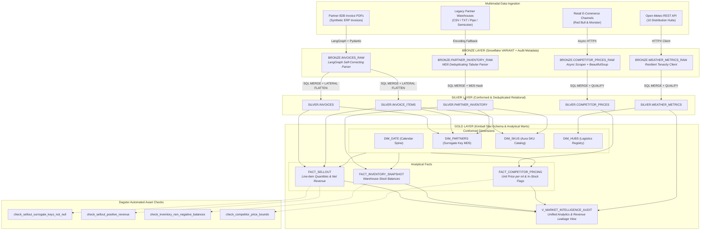

# ⚡ Aura Intelligence Hub

**Enterprise Data Lakehouse & Competitive Intelligence Platform for Aura Energy Drink**

[](https://github.com/jhonatangs/aura-intelligence-hub/actions/workflows/ci.yml)
[](https://www.python.org/downloads/)
[](https://github.com/astral-sh/ruff)
[](https://dagster.io/)
[](https://www.snowflake.com/)

---

## 1. Executive Summary & Business Scope

**Aura Intelligence Hub** is an enterprise data lakehouse and algorithmic competitive intelligence platform built for **Aura Energy Drink**. Operating across key Brazilian metropolitan distribution hubs (São Paulo, Rio de Janeiro, Belo Horizonte, Curitiba, Porto Alegre, Salvador, Recife, Fortaleza, Goiânia, and Cuiabá), the platform unifies heterogeneous B2B partner ecosystems and external market signals to drive three strategic business objectives:

1. **B2B Sell-Out Audit & Revenue Leakage Detection**: Audit distributor invoice items against inventory snapshots to reconcile sell-out volumes, allocated taxes, and detect missing or under-reported partner revenue.
2. **Retail Price Benchmarking**: High-frequency concurrent web scraping tracking retail pricing, volume pricing ($/ml), and availability dynamics against category incumbents **Red Bull** and **Monster Energy**.
3. **Climatic Consumption Elasticity**: Correlate seasonal consumption spikes and inventory depletion velocity with daily maximum temperatures and precipitation levels via Open-Meteo REST APIs.

---

## 2. End-to-End System Architecture

The platform strictly adheres to the **Snowflake Medallion Lakehouse** architecture orchestrating data flow through **Dagster Software-Defined Assets (SDAs)** with pure push-down SQL transformations and automated data quality checks.



---

## 3. Core Architectural Highlights

### 3.1 LangGraph Self-Correcting Invoice Parser
- **Problem**: Partner B2B distributors generate disparate PDF layouts with differing formatting conventions, missing tax breakdowns, and numerical discrepancies.
- **Solution**: A cyclic stateful agent built on **LangGraph** with **Pydantic v2** structured validation:
  - **Extraction Node**: Converts token streams from `pypdf` into typed schemas (`InvoiceItem`, `InvoiceMetadata`, `RawInvoicePayload`).
  - **Validation Node**: Enforces mathematical invariants (`total_amount == sum(items)`), positive values, and Brazilian CNPJ formatting.
  - **Self-Correction Loop**: If validation fails, errors are routed back to the LLM with surgical error context for up to 3 automated recovery attempts.

### 3.2 Snowflake SQL Pushdown & Medallion Design
- **Bronze Layer (`AURA_LAKEHOUSE.BRONZE`)**: Schema-on-read landing zone. Stores raw semi-structured JSON in Snowflake `VARIANT` columns alongside tracking metadata (`source_file`, `partner_id`, `ingested_at`).
- **Silver Layer (`AURA_LAKEHOUSE.SILVER`)**: Conformed, deduplicated relational tables. Powered by idempotent pushdown `MERGE INTO ... USING (SELECT ... QUALIFY ROW_NUMBER() OVER (...) = 1)`.
- **Gold Layer (`AURA_LAKEHOUSE.GOLD`)**: Kimball star-schema:
  - Dimensions: `DIM_DATE` (1,826 days deterministic sequence), `DIM_PARTNERS` (`MD5(partner_id)`), `DIM_SKUS` (`MD5(sku)`), and `DIM_HUBS`.
  - Facts: `FACT_SELLOUT`, `FACT_INVENTORY_SNAPSHOT`, `FACT_COMPETITOR_PRICING` (with `price_per_ml`).
  - Analytical Mart View: `V_MARKET_INTELLIGENCE_AUDIT`.

### 3.3 Security & Zero-Trust Infrastructure
- **Enterprise RSA 2048-bit PKCS#8 Key-Pair Authentication**: Eliminates plain-text passwords and rotating secrets.
- **Infrastructure as Code (IaC)**: Idempotent SQL scripts (`scripts/init_snowflake.sql`) specifying warehouse auto-suspend (60s), auto-resume, and initial suspension (`INITIALLY_SUSPENDED = TRUE`) to prevent compute leakage.

### 3.4 Dagster Orchestration & Data Quality Checks
- **Software-Defined Assets**: 16 partitioned/grouped assets representing the complete lineage across Bronze, Silver, and Gold.
- **Automated Quality Checks**: First-class `@asset_check` assertions running post-modeling:
  - `check_sellout_surrogate_keys_not_null`: Asserts zero null foreign keys (`partner_key`, `sku_key`, `date_key`).
  - `check_sellout_positive_revenue`: Asserts `total_price >= 0` and `net_revenue >= 0`.
  - `check_inventory_non_negative_balances`: Asserts `stock_quantity >= 0`.
  - `check_competitor_price_bounds`: Asserts `price_per_ml > 0`.
- **Automated Scheduling**: Configured in `America/Sao_Paulo` timezone for daily lakehouse materialization (`03:00`) and intraday market intelligence refreshes (every 4 hours).

---

## 4. Getting Started & Developer Setup

### 4.1 Prerequisites
- **Python 3.11+**
- **uv** (ultra-fast package manager): `curl -LsSf https://astral.sh/uv/install.sh | sh`
- **Snowflake Account** (optional for local dry-run execution)

### 4.2 Installation

```bash
# Clone the repository
git clone https://github.com/jhonatangs/aura-intelligence-hub.git
cd aura-intelligence-hub

# Install dependencies deterministically via uv
uv sync --all-groups
```

### 4.3 Environment Configuration

```bash
# Copy template environment file
cp .env.example .env

# Edit .env with your Snowflake parameters and RSA private key path:
# SNOWFLAKE_ACCOUNT=xy12345.us-east-1
# SNOWFLAKE_USER=AURA_SVC_USER
# SNOWFLAKE_PRIVATE_KEY_PATH=rsa_key.p8
# SNOWFLAKE_ROLE=ACCOUNTADMIN
# SNOWFLAKE_WAREHOUSE=COMPUTE_WH
# SNOWFLAKE_DATABASE=AURA_LAKEHOUSE
```

---

## 5. Running the Platform

### 5.1 Local Dagster UI

Launch the interactive Dagster development server to inspect asset lineage, launch jobs, and monitor asset checks:

```bash
uv run dagster dev
```

Open your browser at **`http://localhost:3000`** to access:
- **Global Asset Graph**: Visualize Bronze -> Silver -> Gold dependencies.
- **Asset Checks Tab**: Monitor data quality assertions in real-time.
- **Jobs & Schedules**: Inspect `lakehouse_e2e_job` and `intraday_market_intelligence_job`.

### 5.2 End-to-End Pipeline Runner CLI

Trigger the entire Medallion pipeline with detailed execution telemetry:

```bash
# Full dry-run preview (offline, zero external API/database calls)
uv run python scripts/run_e2e_pipeline.py --dry-run

# Live pipeline execution against Snowflake Lakehouse
uv run python scripts/run_e2e_pipeline.py

# Skip ingestion and run only Silver, Gold, and Quality Checks
uv run python scripts/run_e2e_pipeline.py --skip-ingestion
```

Example Telemetry Output:
```text
================================================================================
                 AURA LAKEHOUSE E2E PIPELINE EXECUTION TELEMETRY
================================================================================
Stage                          | Status     | Duration (s)   | Rows / Checks
--------------------------------------------------------------------------------
Bronze Ingestion               | SUCCESS    | 0.4201         | 10 rows
Silver Cleansing               | SUCCESS    | 0.3120         | 100 rows
Gold Dimensional Modeling      | SUCCESS    | 0.2854         | 1924 rows
Data Quality Checks            | SUCCESS    | 0.1492         | 4 passed, 0 failed
--------------------------------------------------------------------------------
Total Pipeline Runtime: 1.1667s
Overall Result: SUCCESS
================================================================================
```

### 5.3 Individual Layer CLIs

```bash
# 1. Partner Invoice Ingestion (PDF -> LangGraph -> Bronze)
uv run python src/ingestion/pipelines/run_invoice_ingestion.py --dry-run

# 2. Multimodal Ingestion (Weather + Scrapers + Legacy Inventory)
uv run python src/ingestion/pipelines/run_multimodal_ingestion.py --source all --dry-run

# 3. Silver Conformed Transformations
uv run python src/transformation/pipelines/run_silver_transforms.py --target all --dry-run

# 4. Gold Dimensional Transformations
uv run python src/transformation/pipelines/run_gold_transforms.py --target all --dry-run
```

---

## 6. Testing, Quality Gates & CI/CD

The project enforces strict software engineering standards with 100% offline, isolated mock testing (zero external live network or database leaks):

```bash
# Run Ruff linting
uv run ruff check .

# Run Ruff code formatting check
uv run ruff format --check .

# Run complete test suite with coverage enforcement (88%+ coverage across src/)
uv run pytest -v --cov=src --cov-fail-under=80
```

### CI/CD Workflow (`.github/workflows/ci.yml`)
- Automated GitHub Actions runner triggers on all pushes and pull requests to `main`.
- Sets up Python 3.11 with cached `uv`.
- Enforces Ruff linting, formatting, and pytest test suite with mandatory 80%+ coverage threshold.